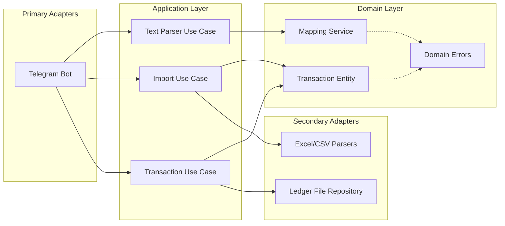

# Architecture

The Finance App follows **Hexagonal Architecture** (also known as Ports and Adapters). This design ensures that the core business logic remains independent of external technologies, frameworks, and I/O devices.
## High-Level Diagram

## Layers

### 1. Domain Layer (`internal/domain`)
The "Heart" of the system. Contains pure business rules and entities.
- **Independence**: Zero dependencies on any other layer or external libraries (except standard library).
- **Transaction**: The central entity. Handles its own validation and formatting for Ledger CLI.
- **Mapping Service**: Logic for keyword resolution and search scoring.

### 2. Application Layer (`internal/app`)
The "Orchestrator". Defines the use cases (actions) the system can perform.
- **Ports**: Interfaces that define how the outside world interacts with the core (`primary.go`) and how the core interacts with the outside world (`secondary.go`).
- **Services**: Implementations of use cases (e.g., `ImportService`, `TransactionService`). They coordinate domain entities and secondary adapters to achieve a goal.

### 3. Adapters Layer (`internal/adapters`)
The "Translation" layer.
- **Primary Adapters (Driving)**: Convert external triggers (Telegram messages, CLI commands) into calls to the Application layer.
    - `telegram`: Manages bot sessions, UI keyboards, and translates user text into system commands.
- **Secondary Adapters (Driven)**: Implement ports defined by the application layer to interact with infrastructure.
    - `ledger`: Handles raw file I/O for the `.ledger` database.
    - `excel`: Implements specific bank format parsing (OpenBank, ImaginBank).

## Data Flow: Manual Entry Example

1.  **Trigger**: User sends "10 coffee" to Telegram.
2.  **Primary Adapter**: `TelegramAdapter` receives text and calls `TransactionParserUseCase.ParseText("10 coffee", "Telegram")`.
3.  **Application Layer**: `TransactionParserService` uses `MappingService` (Domain) to resolve "coffee" -> "Expenses:Food".
4.  **Interaction**: `TelegramAdapter` stores a draft in its `SessionManager` and asks the user for confirmation via inline buttons.
5.  **Persistence**: User clicks "Confirm". `TelegramAdapter` calls `TransactionUseCase.Add(draft)`.
6.  **Validation**: `TransactionService` (App) runs `draft.Validate()` (Domain).
7.  **Output**: `TransactionService` calls `TransactionRepository.Create(transaction)` (Secondary Adapter).
8.  **Final Action**: `TransactionFileRepository` writes the formatted string to the physical `.ledger` file.
